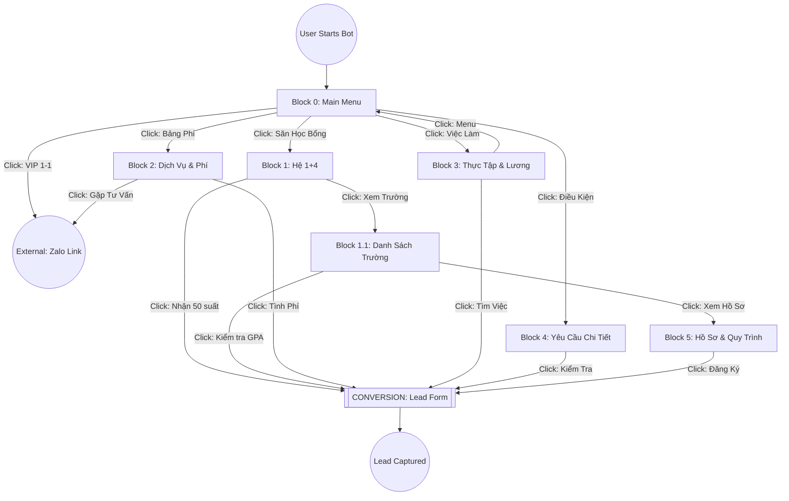

# SIGE Facebook Chatbot Specification (March 2026 Intake)

This document provides the structured message blocks and logic needed to replicate the SIGE AI Agent's conversion-optimized experience on Facebook Messenger.

---

## 🚀 Strategy Overview
- **Goal**: Convert cold/warm traffic into sales leads.
- **Tone**: Professional, authoritative, and supportive ("Vibe Viện trưởng").
- **Conversion Hook**: Always offer a high-value action (CTA) at the end of every message.

---

## 🔄 Conversational Flow Diagram

## 🏠 Block 0: Welcome Menu (Home)
**Text:**
"🚀 **Hệ sinh thái Du học SIGE - Tuyển sinh Kỳ 3/2026**

Chào mừng bạn đến với SIGE AI Consultant! Dựa trên 20 năm kinh nghiệm của Viện trưởng Nguyễn Thị Điệp, chúng tôi mang tới lộ trình du học Đài Loan bền vững nhất.

Bạn quan tâm đến mục tiêu nào? 👇"

**Persistent Menu / Quick Replies:**
1. 🎓 Săn Học Bổng 2026 -> [Go to Block 1]
2. 💰 Bảng Phí & Dịch Vụ -> [Go to Block 2]
3. 💼 Việc Làm & Lương Thưởng -> [Go to Block 3]
4. 📝 Kiểm Tra Điều Kiện -> [Go to Block 4]
5. 🚀 Đăng Ký Tư Vấn VIP 1-1 -> [URL: https://zalo.me/0938491111]

---

## 🎓 Block 1: Săn Học Bổng (Hệ 1+4)
**Text:**
"🎯 **Chương trình Hệ chuyên ban Quốc tế 1+4 (Dự bị Đại học):**

Đây là lộ trình du học ưu tiên của SIGE dành cho kỳ tuyển sinh tháng 3/2026.
**Điều kiện & Quy định:**
- **GPA:** Từng kỳ cấp 3 tối thiểu **6.0**.
- **Chỉ tiêu:** Riêng trường Minh Truyền (MCU) dự kiến chỉ còn ~50 suất ưu tiên.
- **Học bổng:** Miễn 100% học phí năm đầu.

👉 Nên nộp hồ sơ sớm vì hệ này chốt chỉ tiêu rất nhanh!"

**CTAs:**
- [📥 Nhận danh sách 50 suất ưu tiên] -> [Trigger Lead Flow]
- [🏫 Xem danh sách trường liên kết] -> [Go to Block 1.1]

---

## 🏫 Block 1.1: Danh Sách Trường
**Text:**
"🏫 **Các trường đại học liên kết tiêu biểu (Kỳ 3/2026):**

1. **Minh Truyền (MCU):** Chuẩn Mỹ. Hệ 1+4 chỉ còn ~50 suất.
2. **Lĩnh Đông (LTU):** Top 100 Thiết kế. Hệ VHVL Chăm sóc sắc đẹp (20 suất) học bổng 50-100% kỳ 1.
3. **Đài Cương (TSU):** Bán dẫn & Kỹ thuật, học bổng 100% học phí & KTX toàn khóa.
4. **Trung Tín (CTBC):** Mạnh về AI. Miễn 100% học phí & KTX kỳ đầu.
5. **St. John's:** Miễn 100% học phí & KTX kỳ đầu.
6. **Quốc lập Ky Nam:** Miễn học phí 2 năm đầu (Tự túc) hoặc 1 năm đầu (Thạc sĩ).

👉 Bạn muốn nhận thông tin chi tiết về yêu cầu đầu vào của trường nào?"

**CTAs:**
- [📞 Kiểm tra GPA nhận Học bổng] -> [Trigger Lead Flow]
- [📂 Xem hồ sơ cần chuẩn bị] -> [Go to Block 5]

---

## 💰 Block 2: Bảng Phí & Dịch Vụ (Sticker Shock Mitigation)
**Text:**
"💰 **Chính sách Học bổng & Các gói Dịch vụ tại SIGE:**

Viện SIGE cung cấp các gói dịch vụ minh bạch:
- **Gói Cơ bản (36M):** Hồ sơ, dịch thuật, luyện phỏng vấn, Visa.
- **Gói VIP (55M):** Trọn gói hồ sơ + Vé máy bay, Bảo hiểm, Tư trang.
- **Gói IELTS (70M):** Cam kết IELTS 5.0 + Dịch vụ VIP.

⚠️ **Lưu ý:** Tổng chi phí có thể được **giảm trừ cực sâu** dựa trên quỹ Học bổng Doanh nghiệp (lên tới 100% học phí).

Để biết mức phí chính xác sau giảm trừ cho trường hợp của bạn, hãy nhấn nút bên dưới! 👇"

**CTAs:**
- [💰 Tính phí cá nhân (Sau giảm trừ)] -> [Trigger Lead Flow]
- [📞 Gặp tư vấn viên ngay] -> [Zalo Link]

---

## 💼 Block 3: Việc Làm & Thực Tập
**Text:**
"💼 **Thực tập & Việc làm (Chính sách 2026):**

SIGE cam kết lộ trình thực nghiệp an toàn:
- **Hệ VHVL:** Thực tập kỳ 2/4. Lương ~28.590 TWD/tháng.
- **Hệ Tự túc:** Làm 20h/tuần sau 6 tháng học tiếng.
- **Hành lang Pháp lý:** SIGE hỗ trợ chuyển đổi Visa Kỹ sư sau tốt nghiệp."

**CTAs:**
- [💼 Tìm việc làm lương cao] -> [Trigger Lead Flow]
- [🔙 Quay lại Menu] -> [Go to Block 0]

---

## 📝 Block 4: Điều Kiện Tuyển Sinh
**Text:**
"📝 **Yêu cầu tuyển sinh chi tiết (Cập nhật 2026):**

1. **Hệ 1+4 & VHVL:** GPA từng kỳ từ **6.0**. Tuổi 18-22.
2. **Hệ Thạc sĩ:** TOCFL A2 (bản giấy). Học bổng Lĩnh Đông (100% QTDN/MBA), Ky Nam (miễn năm 1).
3. **Sức khỏe:** Khám theo mẫu Đài Loan.
4. **Pháp lý:** Lý lịch tư pháp số 2 sạch."

**CTAs:**
- [✅ Kiểm tra điều kiện dự tuyển] -> [Trigger Lead Flow]

---

## 📂 Block 5: Hồ Sơ & Quy Trình
**Text:**
"🚀 **Quy trình 7 bước tại SIGE:**

Từ lúc nộp hồ sơ đến khi hạ cánh Đài Loan, bạn sẽ trải qua lộ trình: Ký hợp đồng -> Phỏng vấn trường -> Luyện tiếng -> Nộp Visa -> Bay & Nhận KTX.

Viện SIGE hỗ trợ trọn bộ dịch thuật và thủ tục pháp lý!"

**CTAs:**
- [✍️ Đăng ký tư vấn lộ trình] -> [Trigger Lead Flow]

---

## ✨ Branding: Tại sao chọn SIGE?
**Text:**
"🇹🇼 **Tại sao chọn Hệ sinh thái SIGE?**

Viện Khoa học Giáo dục hỗ trợ SV tiếp cận các chương trình độc quyền: Joint Degree 3+1 (Anh/Úc), Hệ sinh thái bảo trợ trọn đời.

⚠️ **Lưu ý:** Chương trình 2+2+3 (Mỹ) đã **hết chỉ tiêu** cho kỳ tháng 3/2026. Liên hệ để đặt chỗ kỳ tháng 9/2026.

✨ **Vibe từ Viện trưởng:**
> *"Với mạng lưới 20 năm tâm huyết tại Đài Loan của tôi, SIGE không chỉ đưa bạn đi học, mà là đưa bạn vào một hệ sinh thái bảo trợ trọn đời."* 
— **ThS. Nguyễn Thị Điệp** (Viện trưởng SIGE)"

**CTAs:**
- [🚀 Đăng Ký Tư Vấn VIP 1-1] -> [URL: https://zalo.me/0938491111]

---

## 🛠️ Developer Implementation Details:

### 1. Keyword Trigger Mapping (NLP)
If the Facebook Bot uses NLP/Keywords, please map the following:
| Keyword | Destination |
| :--- | :--- |
| "học bổng", "1+4", "dự bị" | Block 1 |
| "chi phí", "giá", "bảng phí" | Block 2 |
| "việc làm", "lương", "đi làm" | Block 3 |
| "điều kiện", "yêu cầu", "gpa" | Block 4 |
| "hồ sơ", "quy trình", "thủ tục" | Block 5 |
| "tư vấn", "zalo", "điện thoại" | Block 0 (then Zalo link) |

### 2. Lead Flow Components
The "Lead Flow" (Conversion) should be a form or sequential questions capturing:
- Full Name
- Phone Number (Validated)
- Year of Birth
- Current GPA
- Province/City

### 3. Links & Assets
- **Zalo Link**: `https://zalo.me/0938491111`
- **Branding Assets**: Use the "Viện trưởng Quote" in the 'Why Choose SIGE' section as a persistent trust-builder.
